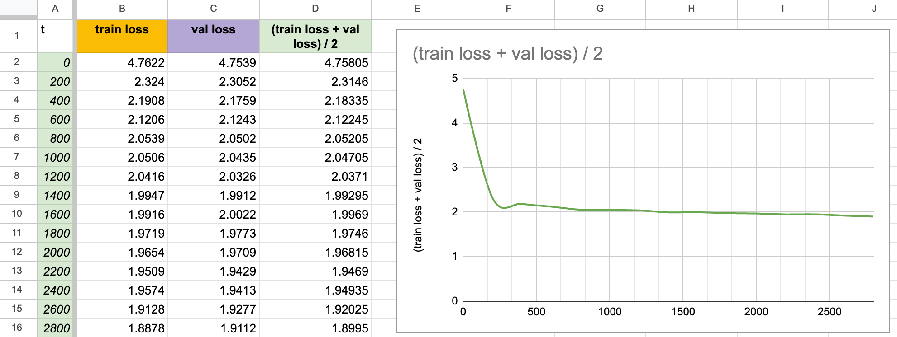

# MonoGPT
> Author(s): Henry Yost (henry-AY), Jessy Garcia (jgarc826), Dmitry Sorokin (Dekamayaro)

MonoGPT is a locally hosted front-end application capable of training and generating output from custom-trained model weights. The interface is designed to be intuitive and interactive; users can initiate model training directly from the GUI or request text generation as well. Each action is visually represented in the UI through animations that illustrate the underlying back-end process. Additionally, MonoGPT does not use HuggingFace transformers, giving you complete control over the transformer(s) implementation with raw PyTorch code.

**Additional Info**: A <ins>Generative Pre-trained Transformer</ins> (GPT) is a type of artificial intelligence that understands and generates human-like text. We will be using the <a href="https://pytorch.org/docs/stable/nn.html"><ins>PyTorch.nn</a> (Neural network) library</ins> which houses transformer architecture. The goal of MonoGPT is to generate linguistic text that resembles human capabilities. Ultimately, we want the model to produce undifferentiable English text (compared to a human). The majority and basis of the architecture originates from Andrej Karpathy's <a href="https://github.com/karpathy/nanoGPT">nanoGPT</a> GitHub repository; however, all analyses and text files are independent and licensed separately.

If you are interested in reading more about the architecture of monoGPT, please refer to [ARCHITECTURE.md](https://github.com/henry-AY/monoGPT/blob/ea413814b004bf45ed3e5b44b3c686f4b9927998/ARCHITECTURE.md)

## Features + Tech Stack
* Character-level tokenization and generation
* Model weights trained from scratch using PyTorch
* Model weights saved as checkpoints and final
* React and Node.js frontend
* Works with custom datasets

| Layer        | Tech                                 |
|--------------|--------------------------------------|
| Frontend     | React.js, CSS, Framer Motion, WebGL  |
| Backend      | FastAPI, Python                      |
| ML Framework | PyTorch (`torch.nn`, transformers)   |
| Architecture | Custom GPT-like Transformer          |

## Installation & Usage
To install and run this project locally, please follow the written instructions below. 

> [!CAUTION]
> This guide assumes you have both Python (for the backend + ML engine) and Node.js (for the frontend GUI). The setup assumes you're comfortable working in a terminal with virtual environments or Node package managers.

> Continue

## References

<a href="https://github.com/karpathy/nanoGPT">nanoGPT</a> (Andrej Karpathy), <a href="https://proceedings.neurips.cc/paper_files/paper/2017/file/3f5ee243547dee91fbd053c1c4a845aa-Paper.pdf"><i>Attention Is All You Need</i></a>, <a href="https://www.gutenberg.org/"><i>Project Gutenberg</i></a>

## Model Training Analysis

#### 2/21/25

To normalize the training loss and validation loss, we averaged the values [(trainloss + valloss) / 2] to get a loss graph, which follows a typical and expected loss curve. There is a rapid drop, which is expected because the model is learning the basic patterns in the data. At t = ~1000, we see a noticeable increase in the flattening of the curve (especially compared to t = ~500). This could mean that the model is beginning to converge. At t = ~1500 to 2800 iterations, the loss stabilizes quite significantly, which possibly indicates diminishing returns of the training, and the model is near convergence. To address this, we plan to train on a new dataset and adjust the hyperparameters.  

  

#### 4/6/25

In this 20-epoch training of our model, we initially observe a high training and validation loss at the first step, which is typical as the model begins without prior learning. A rapid decline in loss follows immediately as the model quickly learns fundamental patterns in the data. For the majority of the training period, the training and validation losses closely track each other, indicating consistent learning.

However, at later epochs, around step 15,000, the validation loss stops decreasing and becomes stagnant while the training loss continues a gradual decline. This emerging gap between training and validation performance suggests the model is beginning to learn training data specifics rather than generalizable patterns, which is indicative of early-stage overfitting.

Therefore, while the model exhibits only mild overfitting tendencies towards the end of training, this warrants exploring techniques such as regularization, early stopping, or learning rate scheduling to enhance the performance of the model.

  

